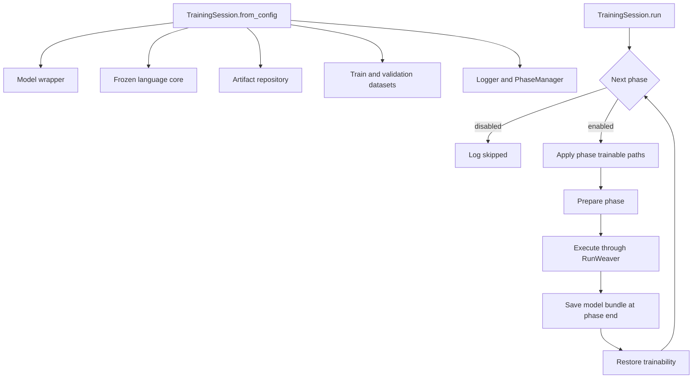

# LI Concept Model v2 Architecture

## Scope

This document describes the software architecture implemented in V2. It
separates model construction from training-session assembly, and V2-owned
training code from the external `runweaver_ml` runtime.

```text
┌──────────────────────── Model architecture ─────────────────────────┐
│ Registered ModelComponents → TrainingModelWrapper → model bundle     │
│ External frozen runtime models are constructed separately            │
└──────────────────────────────┬───────────────────────────────────────┘
                               │ model/control protocol
┌──────────────────────────────▼───────────────────────────────────────┐
│ V2 TrainingSession                                                   │
│ owns session runtime; prepares a fresh phase execution per phase     │
└──────────────────────────────┬───────────────────────────────────────┘
                               │ prepared TrainingModule and loaders
┌──────────────────────────────▼───────────────────────────────────────┐
│ runweaver_ml                                                        │
│ dataset management, phase/parameter contracts, train/validation loop│
└─────────────────────────────────────────────────────────────────────┘
```

## 1. Model architecture

`src/modules` contains components that define model behavior and model
persistence. A registered `ModelComponent` is a PyTorch module with explicit
mode and trainability controls and configuration-plus-weight serialization.
`TrainingModelWrapper` stores named components, constructs them from registered
types, exposes their control state, and saves or loads a model bundle.

Model construction does not create datasets, objectives, optimizers, handlers,
phase managers, or a `TrainingSession`. A model bundle contains only the
serialized named model components. External runtime models, such as the frozen
Qwen language core used by the current recipe, are constructed separately and
are not members of the component bundle.

The current concrete model path is an audio feature provider. `WhisperProvider`
consumes typed Whisper encoder features and produces semantic, trait, and timing
streams. `AudioRepresentation` and related payload types define the feature and
representation boundary. `QwenLanguageCore` is a frozen runtime dependency,
not a persisted `ModelComponent`. These are model-level facts; the specific
current experiment wiring is summarized in [design.md](docs/design.md).

## 2. Training architecture

### Entry point and deferred construction

The training-only object graph is created only when the training command is
invoked. `scripts/train.py` accepts a configuration path and calls
`src.training.run_training`. That function resolves YAML first and then calls
`TrainingSession.from_config()`.

This keeps the model wrapper reusable for model loading, inspection, inference,
and focused tests without requiring training data or a training runtime. It also
defers heavyweight training dependencies—datasets, language runtime, logging,
and phase execution—to the training boundary. The session is created once per
training invocation, not as part of model construction and not once per batch.

### Session construction and ownership

`TrainingSession.from_config()` validates the top-level configuration, resolves
the device, and assembles long-lived session dependencies:

- the model wrapper, either built from configured component specs or loaded
  from `models.load_path`;
- the separately constructed language core;
- one shared runtime artifact repository;
- train and validation dataset objects built through RunWeaver;
- the logger and `PhaseManager`;
- `SessionFactories`, which provide replaceable construction seams; and
- the execution-builder mapping, with the built-in `audio_prefix` builder plus
  any builders passed by the caller.

`TrainingSession.run()` iterates configured phases. Disabled phases are logged
and skipped. For an enabled phase it temporarily applies the phase's trainable
paths, prepares that phase's objects, runs it, and restores the prior
trainability state. A `finally` block closes the logger when the run exits.



### Per-phase assembly

The session and the phase manager persist across the run. Each enabled phase
constructs its own loaders, parameter registry and wrapper, execution module,
optimizer, and `TrainLoopConfig`:

1. Apply `run.active_datasets` to the session's train and validation dataset
   objects when the setting is present.
2. Create train and validation loaders with the configured required modalities
   and phase batch-size override (falling back to each split's batch size).
3. Create a `TargetRegistry` from the phase's `targets`, a fresh
   `ScheduleEngine` with `last_step=0`, and register each phase target schedule.
4. Wrap those objects with `ParamProvider` and `ParameterWrapper`. The provider
   resolves scheduled registry values before static run, global, or runtime
   values. `TrainingModule.on_step_begin()` advances the parameter wrapper before
   computing that training batch.
5. Select an execution builder by `run.execution` (default `audio_prefix`).
   The builder assembles the forward strategy, objective sequence, composer,
   metrics, collector, and optional checkpoint handler into a RunWeaver
   `TrainingModule`.
6. Construct the configured Adam or AdamW optimizer from the model's currently
   trainable parameters. Top-level optimizer settings are overlaid by
   phase-local optimizer settings. A phase with no trainable parameters fails.
7. Build `TrainLoopConfig` from runtime schedule/AMP values and the phase's
   `run.steps`.

The `scheduler` field in `PreparedPhase` is currently `None`. Target schedules
(`ScheduleEngine`) control values read by objectives and forwards; they are not
PyTorch learning-rate schedulers. Although RunWeaver accepts an optional
optimizer scheduler, V2 does not currently construct one.

### Trainable paths and mode control

A phase declares dotted paths in `run.trainable`, for example
`audio_provider.semantic_head`. Before phase execution,
`system_trainable()` snapshots current control state, recursively clears
trainability, then enables only the listed paths. The wrapper delegates those
states to each component; enabled parameters receive gradients and are included
in the phase optimizer. The context manager restores the original trainability
state when the phase exits, including on errors.

The audio-prefix builder separately derives train/eval mode maps from the same
paths. `TrainingModule` enters the configured train mode for the training loop
and eval mode for validation, then restores the previous mode. Thus parameter
trainability and module training/evaluation mode are related but distinct
controls.

### Objective and execution assembly

RunWeaver's `ObjectiveComposer` runs one forward strategy to populate a
`TrainingContext`, invokes each `TrainingObjective`, and combines their losses.
V2's `AudioObjectiveComposer` specializes that assembly contract to return the
shared forward payload (including per-objective loss values) to metrics and
collectors. The training factory constructs a `TrainingModule` around the
composer, phase parameters, metrics handler, collector, validation ownership,
and optional checkpoint callback.

This composition makes model components, heads, forward strategies, objective
classes/losses, metrics, collectors, and execution builders separable extension
points. A compatible registered component can be selected in model
configuration. Objectives can be composed or replaced in an execution builder
without writing a new optimization loop; an alternate builder can be supplied
through `execution_builders`. The current built-in builder is specifically
`audio_prefix`: its forward expects the named `audio_provider`, a compatible
audio representation, and a `QwenLanguageCore`. Arbitrary objective graphs and
all provider/head combinations are not currently declared solely in YAML; a
different topology needs a suitable builder/forward composition.

### Phase-local steps and gradient accumulation

RunWeaver initializes the loop counter to zero for every `train_epoch()` call.
For each batch it increments that counter, invokes `on_step_begin(step)`,
computes a loss, performs backward and an optimizer step, then advances logging,
validation, and checkpoint checks. Therefore `run.steps`, loop logging,
`validate_every`, `save_every`, `TrainingModule.current_step`, and scheduled
parameter updates all use phase-local batch steps starting at 1. The session's
`global_step` is a separate cumulative count updated after each phase and used
for session-level phase begin/end records; it is not passed as the next phase's
schedule offset.

Gradient accumulation is **not implemented in the current RunWeaver loop** used
by V2. `TrainLoopConfig` has no accumulation field, and the loop currently calls
`optimizer.zero_grad()` and `optimizer.step()` for each batch. To add
accumulation, the RunWeaver loop would need to define accumulation-window
boundaries, scale microbatch losses, defer optimizer updates, and handle a
partial final window. It would also need to specify whether phase `steps`,
schedules, logging, validation, and checkpoint intervals count microbatches or
optimizer updates. Until that contract is implemented and exposed through
configuration, V2 documentation treats one batch as one optimizer step.

## 3. RunWeaver responsibilities and control flow

RunWeaver owns dataset construction and loaders, phase contexts, target and
schedule primitives, training execution contracts, and the optimization loop.
V2 owns project model construction/persistence, experiment-specific session
assembly, forwards, objectives, metrics, collectors, configuration, and
logging.

```mermaid
sequenceDiagram
    actor User
    participant CLI as scripts/train.py
    participant V2 as V2 run_training / TrainingSession
    participant RW as runweaver_ml
    participant Exec as V2 TrainingModule / composer
    User->>CLI: config path
    CLI->>V2: run_training(path)
    V2->>V2: load_config(path), from_config(config)
    V2->>RW: build datasets and phase contexts
    loop enabled phases
        V2->>RW: create loaders and loop config
        V2->>Exec: build objectives, handlers, execution module
        V2->>RW: PhaseOrchestrator.train_epoch(...)
        loop train batches
            RW->>Exec: on_step_begin(local_step), compute(batch)
            Exec-->>RW: loss, payload
            RW->>RW: backward, optimizer step, scheduler if supplied
            opt validation interval
            RW->>Exec: validation hooks and payloads
        end
        RW-->>V2: completed phase-local steps
        V2->>V2: save model bundle; update session global_step
    end
```

The CLI itself does not assemble components or implement a training loop. It
calls `src.training.run_training.run_training()`, which loads the mapping
configuration and constructs/runs `TrainingSession`. The session prepares a
`TrainingModule`; RunWeaver's `PhaseOrchestrator` calls it for batches and owns
zero-grad, backward, optimizer/scheduler stepping, logging cadence, validation
cadence, checkpoint cadence, autocast, and the loop's local step count.

### Hook lifecycle

For each phase, `PhaseOrchestrator.train_epoch()` calls `on_train_begin()`, then
enters the trainer's train context. Per batch it calls `on_step_begin(local
step)`, computes `(loss, payload)`, backpropagates and steps the optimizer,
optionally steps a supplied scheduler, then calls `on_train_payload()`. Logging
uses `on_log(payload)` at its configured interval. At a validation interval the
orchestrator flushes logs and runs `validate_epoch()` under no-grad and eval
context. Validation calls `on_validation_begin`, `on_validation_payload` for
each validation payload, and `on_validation_end`; it then logs the resulting
summary. For handler-owned validation, V2's metrics handler returns its
reported summary and the collector finalizes its output as a separate side
effect. A configured checkpoint interval calls `on_checkpoint(optimizer,
scheduler)`. Finally, `on_train_end()` runs even if training raises.

With `validation_owner="handlers"` (the V2 audio-prefix setting), the training
module begins metrics and collection at validation start, updates both for each
payload, summarizes/reports metrics at validation end, and finalizes the
collector. The collector's finalization side effect is separate from the
returned metrics summary. Trainer-owned validation is also supported by
RunWeaver, but requires the trainer's reset/update/report metric methods.

## 4. Structural interfaces and collaborators

The current structural `Protocol` is RunWeaver's runtime-checkable
`TrainingModelProtocol`. It defines `get_mode`/`set_mode`,
`get_trainable`/`set_trainable`, `trainable_parameters`, and `to(device)`—the
capabilities needed by RunWeaver's model-control helpers and the objective
composer's forward strategy. V2's `TrainingModelWrapper` satisfies this
contract without inheriting from a RunWeaver class.

The structural protocol keeps the framework boundary small: an application can
provide a compatible wrapper or test double without adopting RunWeaver's
inheritance tree, while RunWeaver can statically describe the operations it
requires. Model creation, serialization, and persistence remain V2-owned.

Other collaborators currently use different contracts. `TrainingObjective`
is an abstract base class defining `compute`, `report`, and metric lifecycle
methods. RunWeaver supplies base classes for metric and collector handlers.
V2's `ExecutionBuilder` and `SessionFactories` use `Callable` fields (the
orchestrator seam is typed `Any`), not a structural Protocol. The docs do not
describe these as Protocol-based extension points.

## 5. Model bundles versus training-session recovery

`TrainingModelWrapper.load()` calls `ModelPersistenceManager.load_model_bundle()`.
The bundle has a format version and serialized named components. Component
types are reconstructed through the registry, and tensors are loaded with the
requested map location. `TrainingSession.from_config()` uses
`models.load_path` to choose this model-loading path; otherwise it constructs
components from `models.components`. The language core is reconstructed
separately in either case.

Loading a model bundle is not resuming an interrupted training session. The
bundle deliberately excludes optimizer state, scheduler state, phase progress,
`global_step`, parameter schedules, logger position, and data-loader/sampler
state. V2 saves model bundles at configured checkpoint hooks and again at every
phase end, but the current checkpoint callback saves the model wrapper only.
There is no session-state restore path.

## 6. Experiment configuration and loading

`src/utils/config_loader.py` loads YAML mappings and recursively resolves
`include` paths relative to the including file. Local mapping values override
included values, and include cycles are rejected. The training configuration
separates:

- `system`: device;
- `models`: registered component specifications, external language-core
  configuration, optional model-bundle load path, and model save directory;
- `datasets`: train/validation dataset specs, required/lazy modalities,
  batch sizes, and optional shared resources; and
- `training`: base optimizer, runtime AMP/log/validation/checkpoint cadence, and
  ordered phases.

Each phase carries `name`, `enabled`, `run`, `targets`, and `schedules`.
`run` specifies phase-local `steps`, `trainable` dotted paths, optional
`execution`, `active_datasets` and `batch_size` overrides, optimizer overrides,
and trainer-specific builder settings. `targets` are values available to
objectives; `schedules` update registered target values through the phase
parameter wrapper.

The YAML describes experiment inputs and phase controls; it does not contain
Python objective implementations or a generic model graph language. Those are
assembled by V2 execution builders. The current recipe is documented in
[design.md](docs/design.md), without duplicating run results here.

## 7. Repository responsibilities

- `src/modules`: model components, typed audio contracts, wrapper, registry,
  and model-bundle persistence.
- `src/training/session`: session assembly and lifecycle.
- `src/training/audio_prefix`: current forward, objectives, composer, metrics,
  and collector.
- `src/utils`: configuration loading.
- `scripts/train.py`: command-line entry point.
- `configs`: experiment configuration.
- `runweaver_ml`: external dataset and training-loop framework; its source is
  not vendored into V2.
